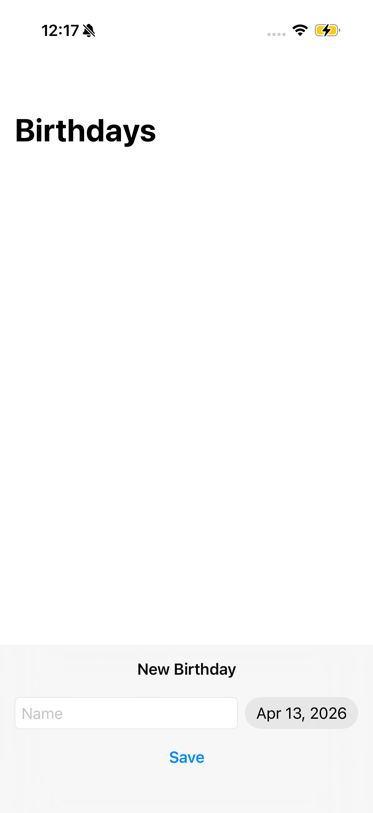
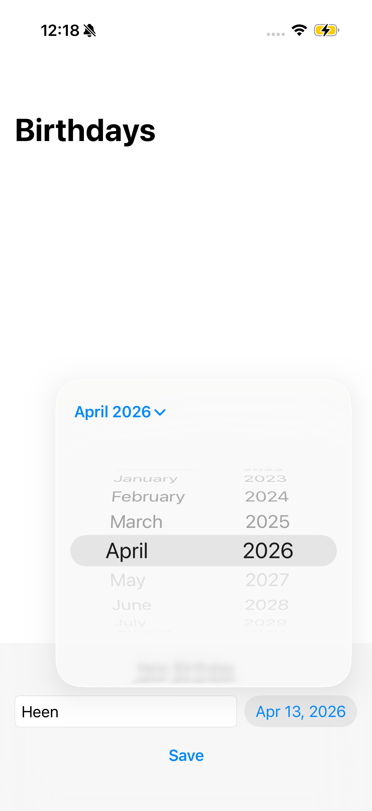
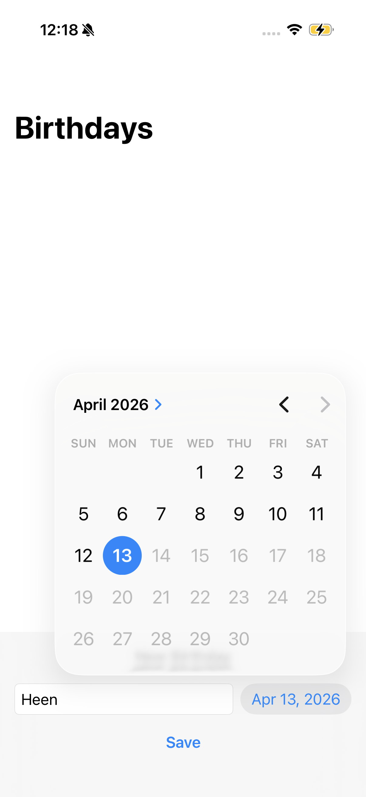
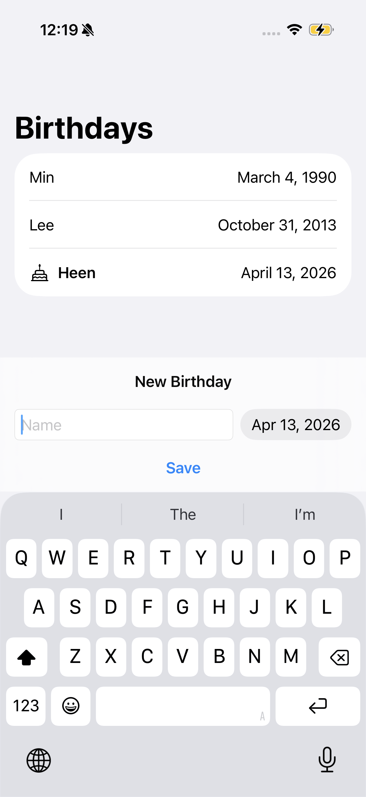

# **[Data Modeling] 1. Birthday**
---
## **배운 내용**
* `NavigationStack{}` : 카드 더미처럼 뷰를 위로 쌓는 데 자주 사용.이때 항상 맨 위에 있는 뷰만 화면에 보이며, 스택의 맨 위에 뷰를 추가하거나 제거할 수 있음.
    * NavigationStack의 주요 목적은 **화면 간 이동(네비게이션)**이지만 네비게이션 바, 버튼, 툴바, 타이틀 같은 기능도 함께 제공.
    
* `.safeAreaInset()`: 인스턴스를 화면 특정 부분에 고정시킬 수 있는 modifier.
```swift
List(friends, id: \.name) { friend in
    // 현 예제에서는 List에 붙여서 사용되었으나, ScrollView, VStack, ZStack 등 다양한 view에 붙여서 사용할 수 있음
    ...
}
.safeAreaInset(edge: .bottom) {
    // edge 방향을 지정하여 해당 방향에 고정된 콘텐츠 영역을 만듦
    ...
}
```

* `DatePicker()`
```swift
DatePicker(selection: $newDate, in: Date.distantPast...Date.now, displayedComponents: .date) {
    TextField("Name", text: $newName)
        .textFieldStyle(.roundedBorder)
}

// selection: 값을 저장할 변수 binding
// in: 선택 가능한 날짜의 범위 (Date.distantPast...Date.now -> 과거~현재만 선택 가능)
// displayedComponents: 표시할 date 범위 (년/월/일, 시/분 등)
// {...}: DatePicker에 대한 레이블(TextField 사용 시, 이름을 동시에 입력받음)
```

* `import SwiftData`+ `@Model`+`class`+ `init`
    * `import SwiftData`: **앱을 꺼도 데이터를 기억**하게 해주는 도구.
    * `class`: **데이터의 설계도**. class로 선언한 변수 하나가 어떤 값들을 가지는지(`var`) 정의해줌.
        * `struct`가 아닌 `class`로 선언하는 이유: `struct`는 복사되는 타입이라 내가 수정하면 원본이 무엇인지 추적 불가. DB는 원본을 추적하고 변화를 정확히 알아야 하기 때문에 `class` 사용.
        ```swift
        class Friend {
            var name: String
            var birthday: Date
        }
        ```
        
    * `@Model`: SwiftData의 핵심 매크로로, 클래스를 영구 저장소(Persistent Store)에 저장 가능한 모델로 변환.즉 `@Model`을 붙이는 순간 SwiftData가 **이 클래스를 자동으로 DB 테이블로 만들어줌.** 
        * 내가 직접 DB 코드 짤 필요 없음
        * `var`이 바뀌면 자동으로 저장됨
        * SwiftUI 화면도 자동으로 업데이트됨
        ```swift
        @Model
        class Friend {
            var name: String
            var birthday: Date
        }
        ```
        
    * `init` : 처음 데이터를 만들 때 어떤 걸 넣을지 결정. 새로운 `Friend`값을 만들 때 **초기값을 세팅**해줌.
    ```swift
        init(name: String, birthday: Date){ //이 객체를 만들 때 name과 birthday를 반드시 넣어서 생성하라는 의미.
        self.name = name         //받은 name을 이 객체의 name에 저장(`self`는 "나 자신(이 객체)" 을 가리킴. 파라미터 이름과 프로퍼티 이름이 같아서 구분을 위해 붙임.)
        self.birthday = birthday //받은 birthday을 이 객체의 birthday에 저장
    }
    ```

* 프리뷰 테스트용 임시 화면 만들기: `.modelContainer`와 `inMemory: true`
    *  `.modelContainer`: 앱 또는 프리뷰에서 SwiftData를 사용하기 위해 어떤 모델을 저장할지 미리 등록하는 역할.
    *  `inMemory:` 데이터를 저장하는 역할.`inMemory: true`와 `inMemory: false`가 있음.
        * `inMemory: true`: 데이터 임시저장. 테스트/프리뷰 시 사용. 프리뷰를 끄면 데이터 사라짐.
        ```swift
        #Preview {
            ContentView()
                .modelContainer(for:Friend.self, inMemory: true)
        }
        ```
        * `inMemory: false`: 데이터 영구저장. 실제 앱 실행 시 사용. 앱을 종료해도 데이터 저장됨.
        
* View에서 데이터 사용하기: `@Query`, `@Environment(\.modelContext)`,`context.insert()`,`context.delete()`
    * `@Query`: SwiftData에서 데이터를 전부 가져올 수 있음.
        * 저장된 데이터를 자동으로 불러옴.
        * 데이터가 추가/삭제되면 알아서 화면 업데이트.
        * 정렬, 필터링을 쉽게 할 수 있음.
        ```swift
        // 일반 변수 - 직접 데이터를 넣어줘야 함
        var friends: [Friend] = []

        // @Query - SwiftData에서 자동으로 가져옴
        @Query var friends: [Friend]
        ```
        
    * `@Environment(\.modelContext)`: `@Environment`는 앱 전체에서 공유되는 정보를 가져옴. 
    ```swift
    // 앱 어디서든 꺼내쓸 수 있는 공유 정보들
    @Environment(\.modelContext)  // 데이터를 추가,삭제,수정할 때 사용
    @Environment(\.colorScheme)   // 다크모드인지 라이트모드인지
    @Environment(\.locale)        // 현재 언어/지역 설정
    ```
    * `context.insert()`: 새 데이터 저장
    * `context.delete()`: 데이터 삭제

## **preview**
<p align="center">
  
  
  
  
</p>

## **tutorial link**
[Apple Developer Tutorial](https://developer.apple.com/tutorials/develop-in-swift/add-functionality-with-swift-testing)
