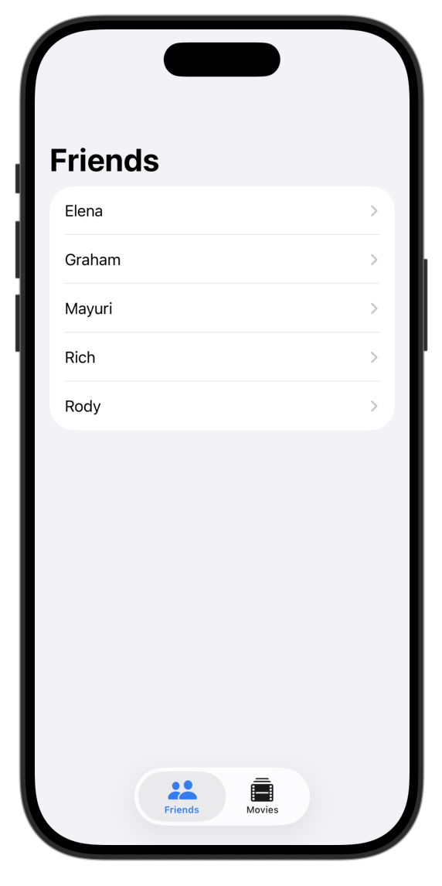
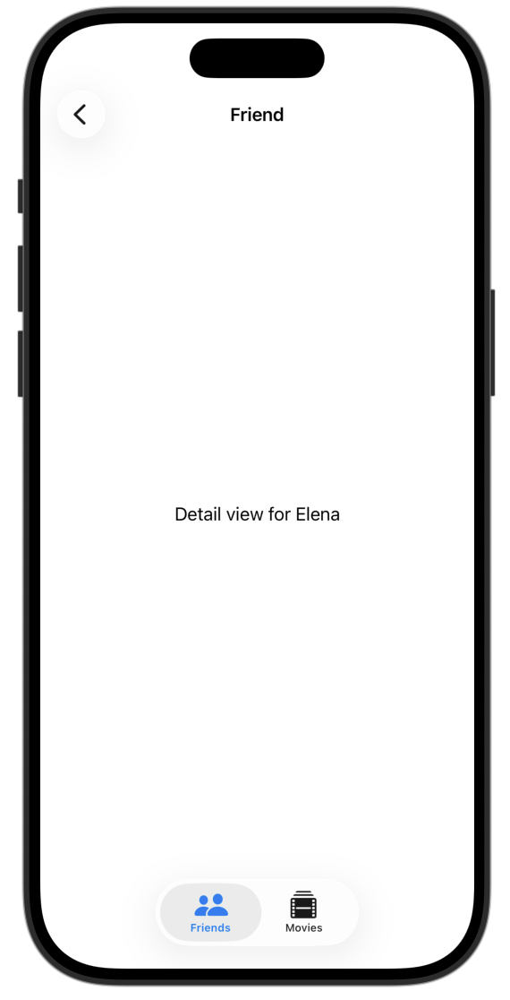
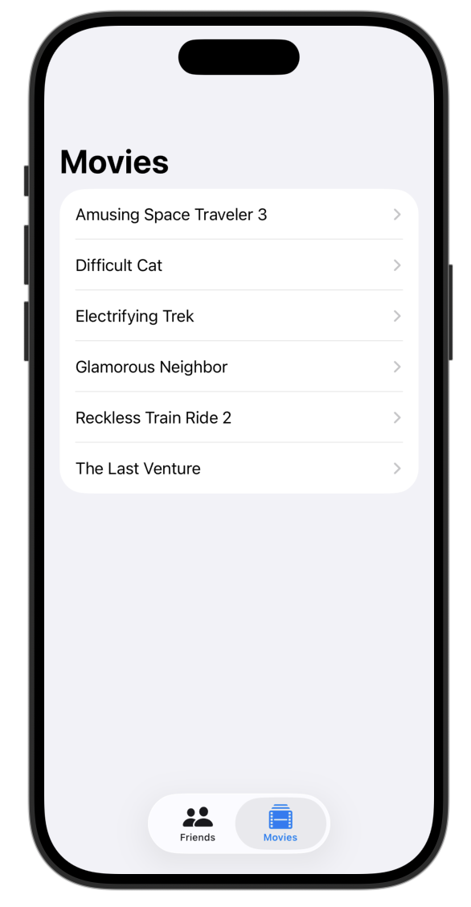
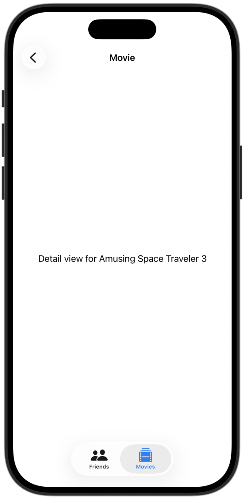

# **[Data Modeling] 3. FriendFavoriteMovies**

## **배운 내용**
<<<<<<< HEAD
1. **`Tab View{}`**
=======
1.** `Tab View{}`**
>>>>>>> 078ce9f (uploadReadme)
```swift
TabView {
    Tab("Friends", systemImage: "person.and.person") {
        Text("Friends")
    }


    Tab("Movies", systemImage: "film.stack") {
        Text("Movies")
    }
}
```
<<<<<<< HEAD
2. **SampleData class 만들기**: `.task` 대신 SampleData를 관리하는 `class`를 따로 만들어서 `#Preview`에서는 샘플 데이터를 보여주고 실제 앱에서는 저장된 데이터만 사용할 수 있도록 함. 같은 View 코드를 그대로 재사용 가능.
  
=======

2. **SampleData class 만들기**: `.task` 대신 SampleData를 관리하는 `class`를 따로 만들어서 `#Preview`에서는 샘플 데이터를 보여주고 실제 앱에서는 저장된 데이터만 사용할 수 있도록 함. 같은 View 코드를 그대로 재사용 가능.
>>>>>>> 078ce9f (uploadReadme)
    1. `Schema` 정의: `Schema`는 SwiftData에게 **이 앱에서 어떤 데이터 모델들을 사용할 건지** 알려주는 목록. `@Model`로 선언된 클래스들을 배열로 넘겨주면, SwiftData가 내부적으로 테이블 구조를 파악.
    2. `ModelConfiguration`: **데이터를 어디에 저장할지** 설정
        * `isStoredInMemoryOnly: true` → 앱이 종료되면 데이터가 사라지는 임시 저장소 (Preview/테스트용)
        * `isStoredInMemoryOnly: false` (기본값) → 디스크에 영구 저장
    3. `ModelContainer` + `do-catch`: 스키마와 설정을 받아서 저장소를 초기화함. 실패할 수 있기 때문에 `try`가 필요하고, 실패하면 앱이 의미 없으므로 `fatalError`로 바로 종료
    ```swift
    do{
    modelContainer =  try ModelContainer(for: schema, configurations: [modelConfiguration])
            
    insertSampleData()
            
        try context.save()
    }catch{
        fatalError("Could not create ModelContainer: \(error)")
    }
    ```
    4. `static let shared = SampleData()`: 싱글톤 패턴.`static let`으로 선언하면 처음 접근할 때 딱 한 번만 생성되고, 이후 `SampleData.shared`로 어디서든 같은 인스턴스를 사용할 수 있음. Preview에서 `.modelContainer(SampleData.shared.modelContainer)` 형태로 주입할 때 쓰임.
    5. `var context: ModelContext { modelContainer.mainContext }`: `ModelContext`는 데이터를 읽고 쓰는 작업 공간. `modelContainer.mainContext`는 메인 스레드에 연결된 컨텍스트를 반환하는 computed property.
    6. `@MainActor`: `@MainActor`를 클래스나 함수에 붙이면 항상 메인 스레드에서만 실행됨을 보장. SwiftUI의 UI 업데이트는 반드시 메인 스레드에서 이뤄져야 하는데, `modelContainer.mainContext` 자체가 메인 스레드 전용이라 `@MainActor`로 그 안전성을 컴파일 타임에 강제할 수 있음.

## **preview**
<p align="center">
  
  
  
  
</p>


## **tutorial link**
[Apple Developer Tutorial](https://developer.apple.com/tutorials/develop-in-swift/navigate-sample-data)
