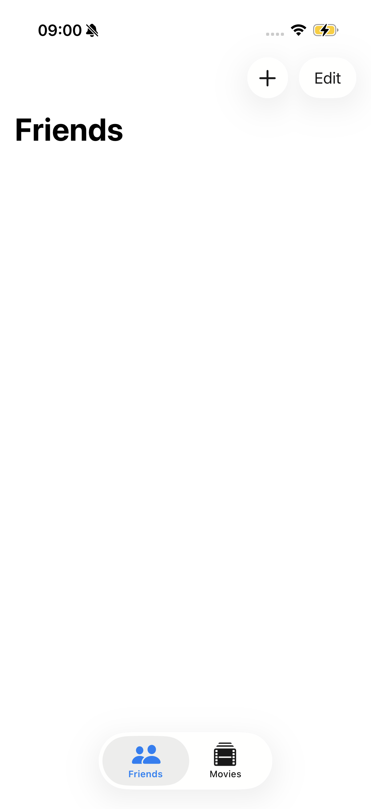
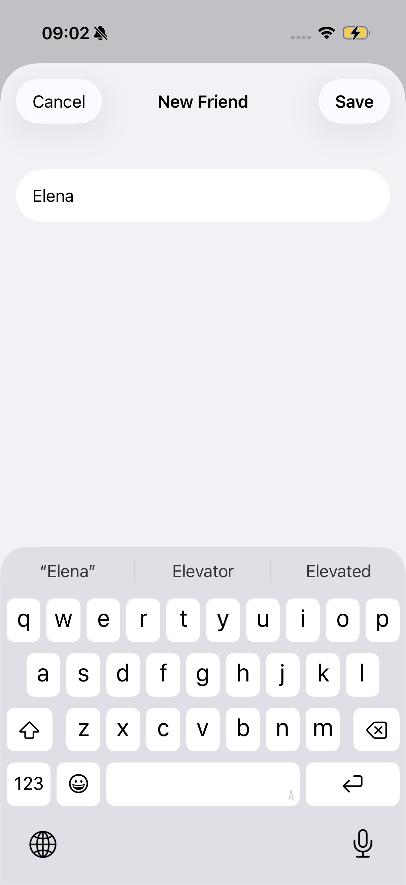
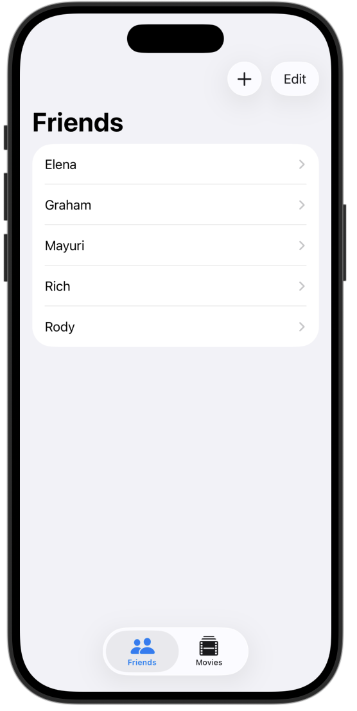
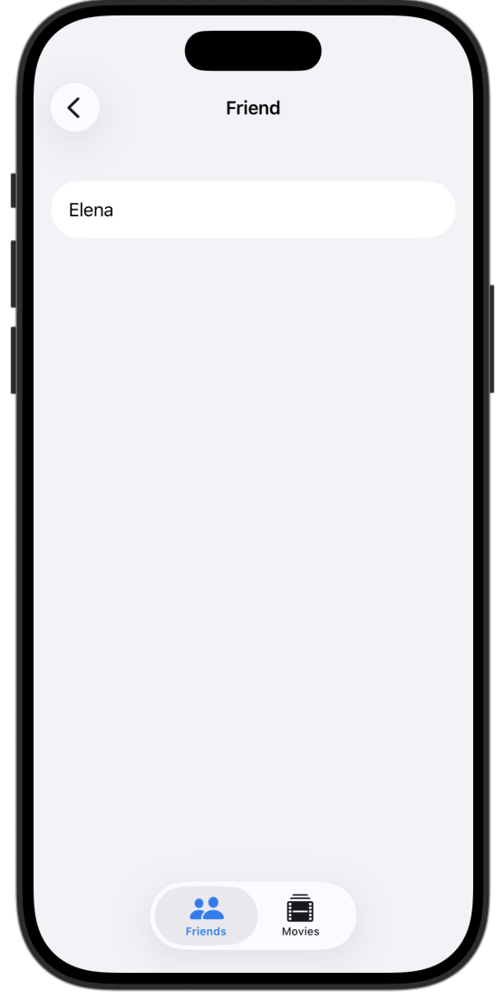
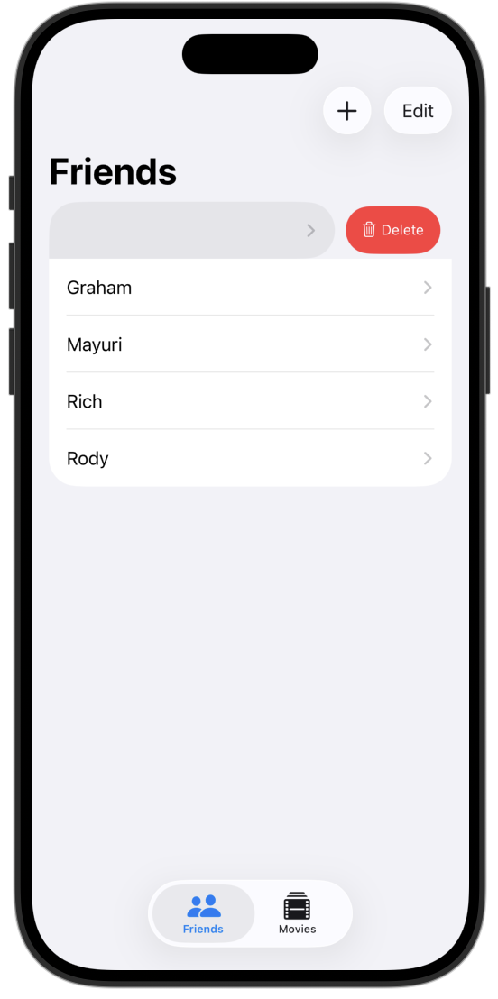
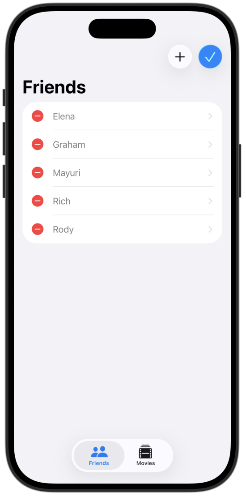

#  **[Data Modeling] 3. FriendFavoriteMoviesDetail**
---
## **배운 내용**
1.** `@Bindable` property**

## **preview**

  
  
  

  
  
  

## **tutorial link**
[Apple Developer Tutorial](https://developer.apple.com/tutorials/develop-in-swift/navigate-sample-data)

