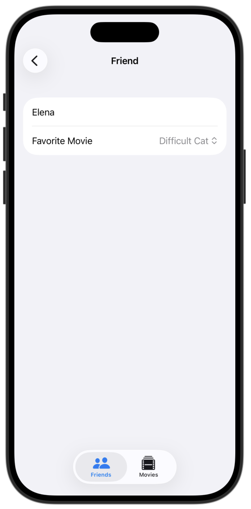
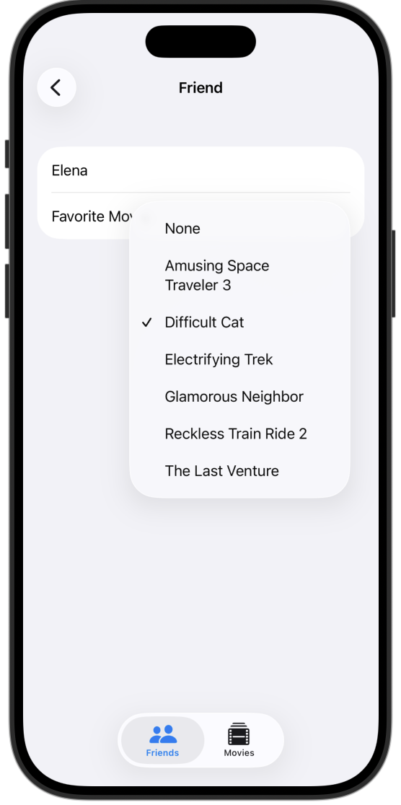
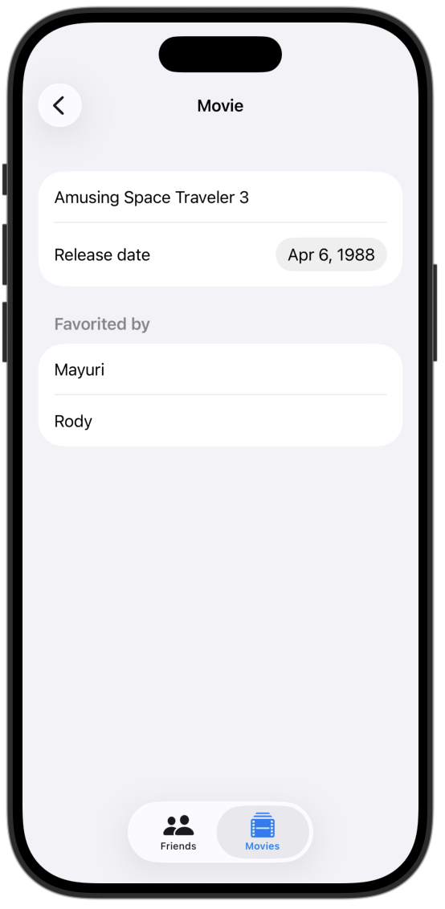
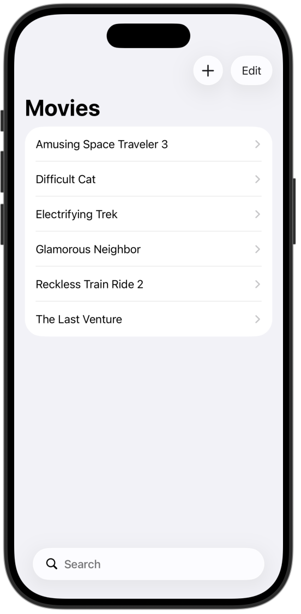
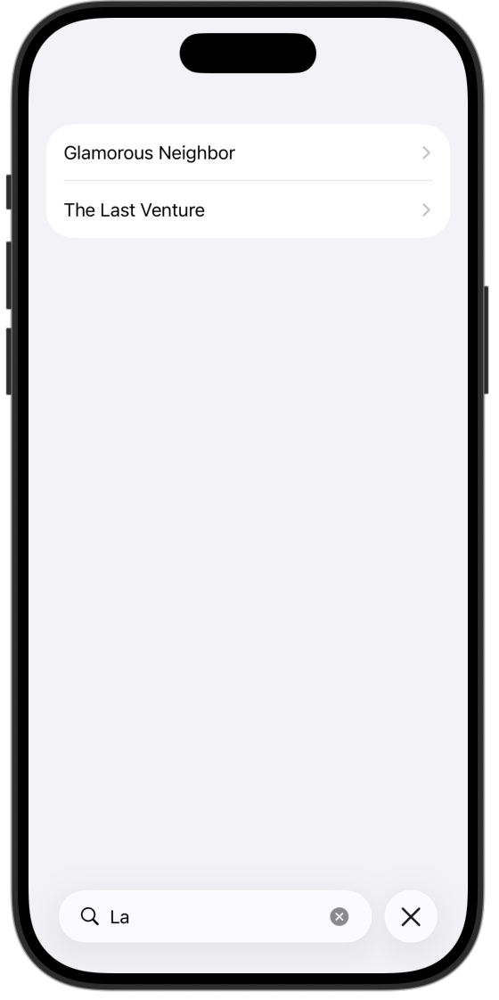

# **[Data Modeling] 5. FriendFavoriteMovies - WorkWithRelationship**
---
## **배운 내용**
1.** 두 데이터 연결하고 관계 만들기 + `Picker` **

2.** 변수 + `.sorted` **

3.** Filter + custom query**

4.** Search Bar**

5.** 비어있는 리스트 화면 만들기 +`Group{}` **

## **preview**

  
  
  
  
  

## **tutorial link**
[Apple Developer Tutorial](https://developer.apple.com/tutorials/develop-in-swift/work-with-relationships)

