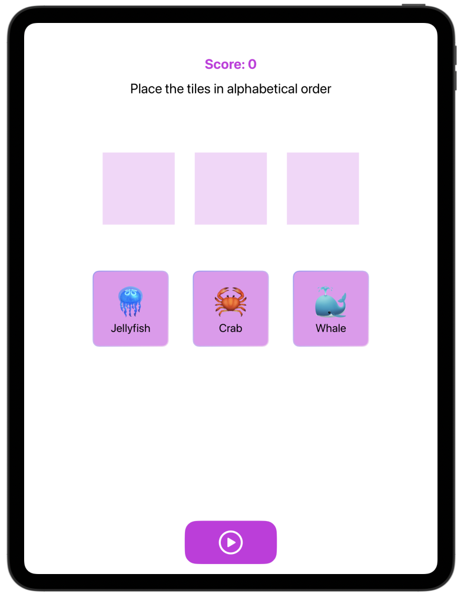
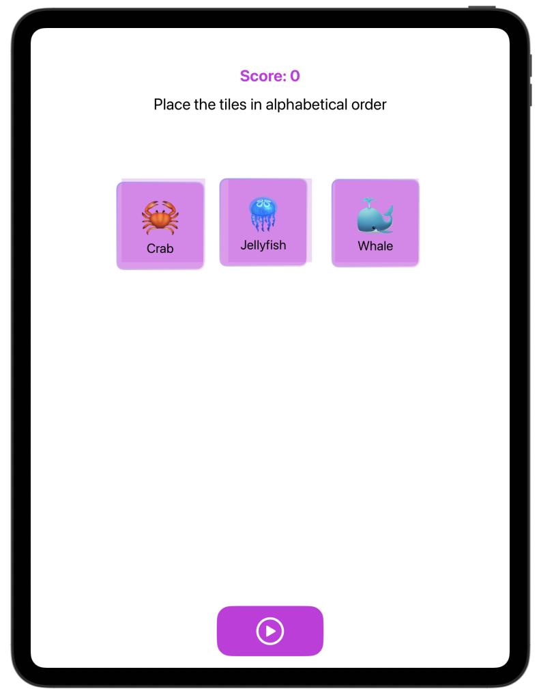
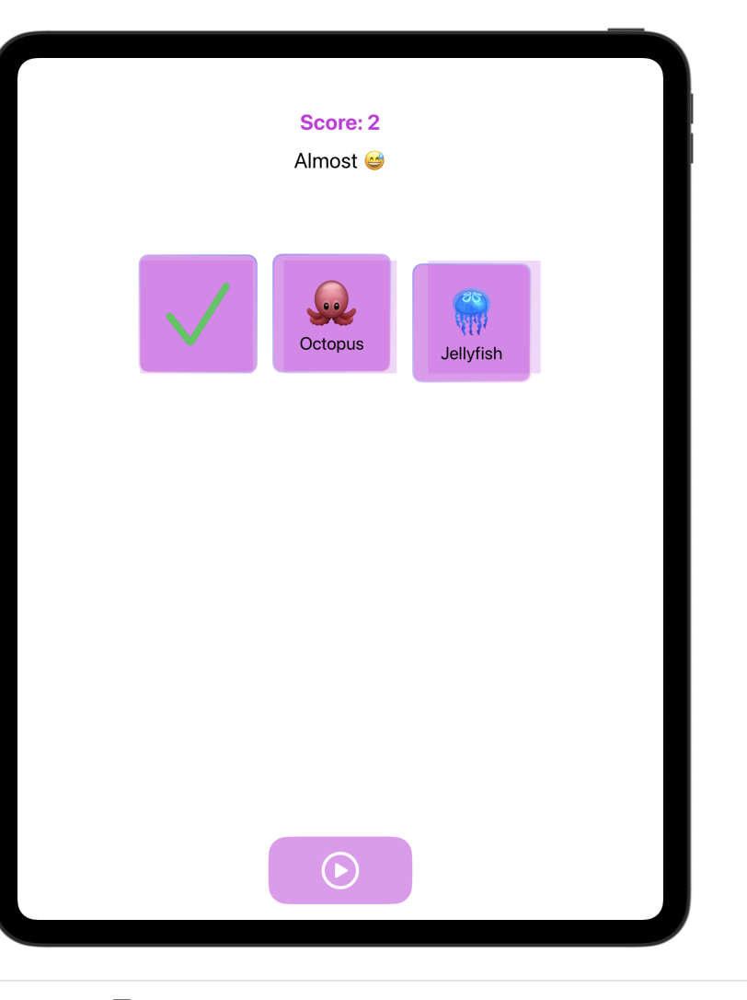
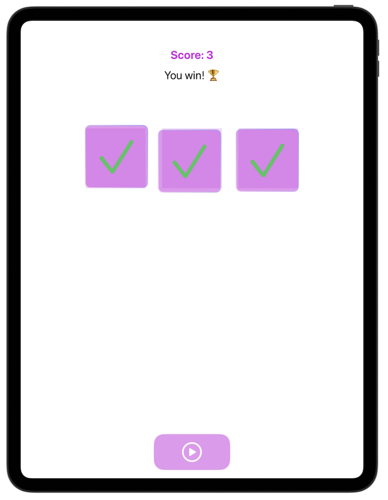
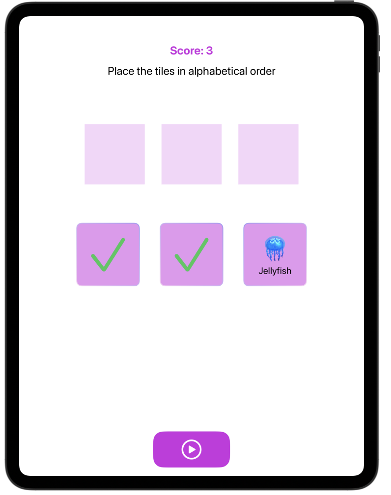

# **[Data Modeling] 6. Alphabetizer**

## **preview**

  
  
  
  
  

## **tutorial link**
[Apple Developer Tutorial](https://developer.apple.com/tutorials/develop-in-swift/complete-a-game-with-logic)

