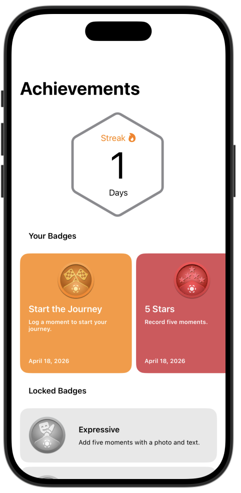
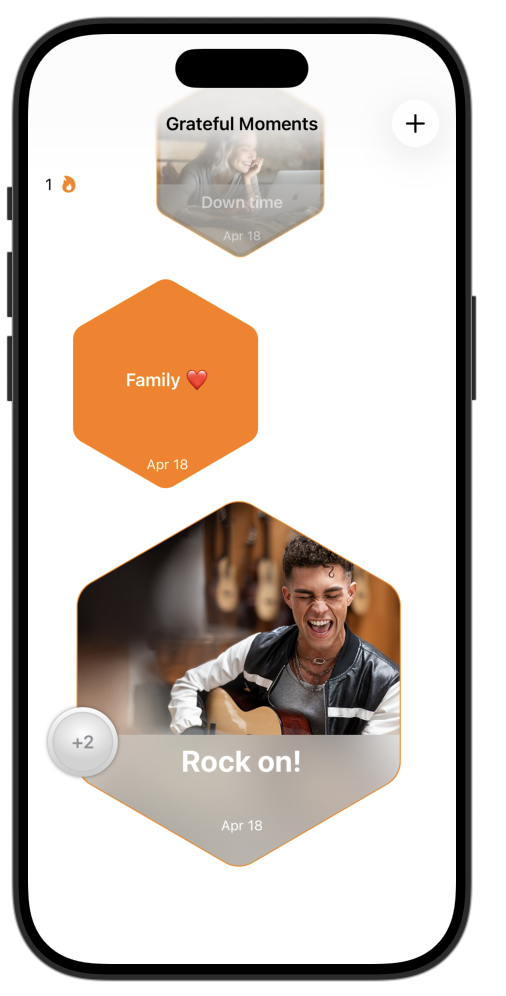
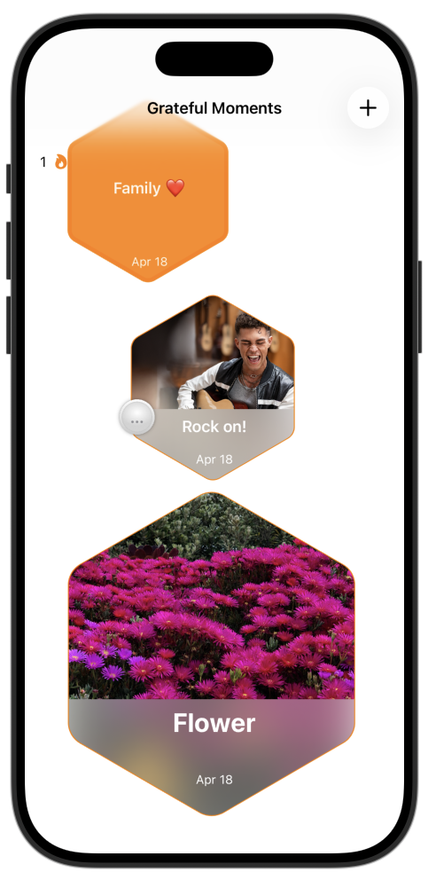

# **[App Development] 5. GratfulMoments - Create an algorithm for badges**
---
## **preview**

  
  
  

## **tutorial link**
[Apple Developer Tutorial](https://developer.apple.com/tutorials/develop-in-swift/create-an-algorithm-for-badges)

