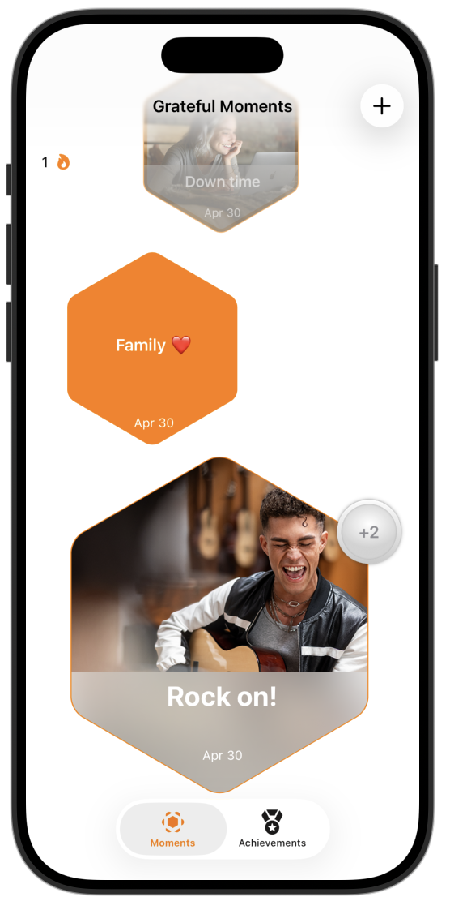
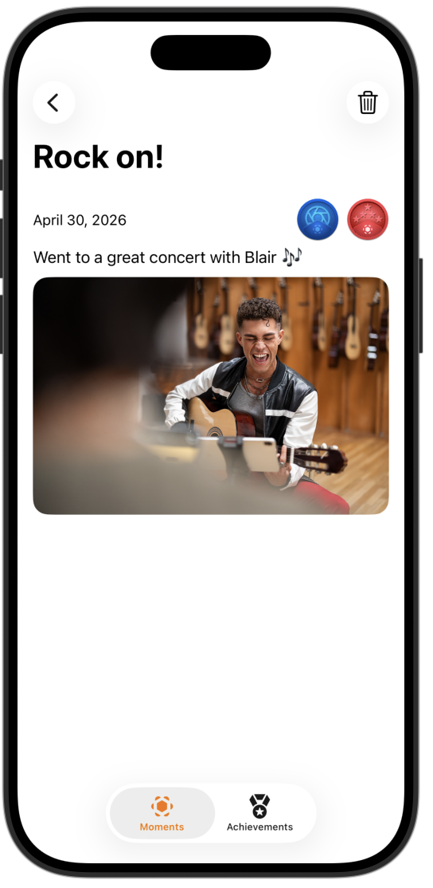
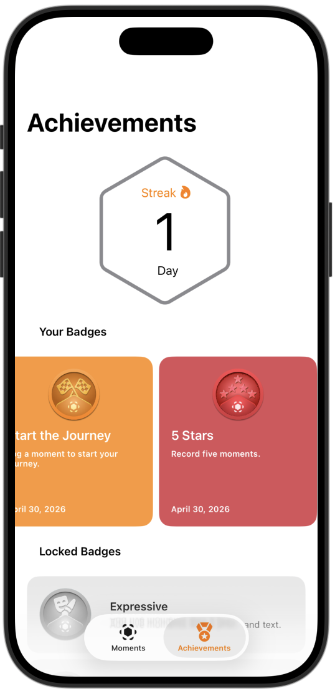
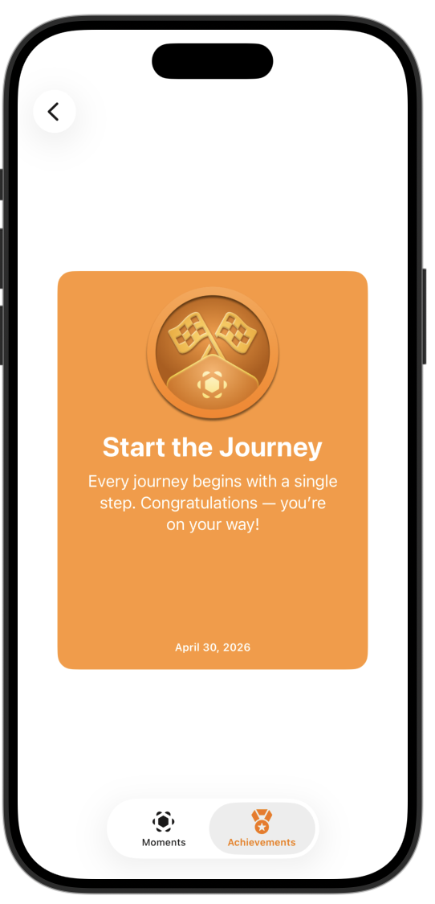
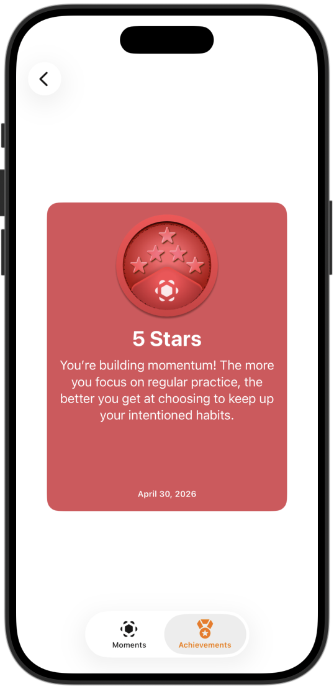

# **[App Development] 5. GratfulMoments - Add inclusive features**

## **배운 내용**
* 1. **Dark Mode**
    * 최상위 뷰의 `Preview` 부분에 코드 추가
```swift
        #Preview("Dark") {
    ContentView()
        .sampleDataContainer()
        .preferredColorScheme(.dark)
    }
```
    * 자식뷰에서 Preview에 코드를 추가하지 않고 Darkmode 볼 수 있는 방법
        * Xcode canvas 왼쪽 하단 토글(canvas setting) -> Color Scheme -> Dart Appearence
        * Xcode canvas 왼쪽 하단 Variants 메뉴 -> Color Scheme Variants
        
* 2. **Dynamic Type** :디바이스에 따라 서체 크기 조정
    * Xcode canvas 왼쪽 하단 토글(canvas setting) -> Dynamic type
    
    * `.minimunScaleFactor` : 텍스트가 축소될 수 있도록 함
    * `.frame(width: )`, `frame(minHeight: )`, `.fixedSize()`: 최소 높이를 설정하고 콘텐츠를 뷰의 크기에 맞게 조정
    * `.dynamicTypeSize(...DynamicTypeSize.xxxLarge)` : 동적글꼴 최대 크기를 xxxLarge로 제한

* 3. **Locale** :사용자의 지역, 언어설정 등을 반영해서 화면의 언어를 조절

## **preview**
<p align="center">
  
  
  
  
  
</p>


## **tutorial link**
[Apple Developer Tutorial](https://developer.apple.com/tutorials/develop-in-swift/add-inclusive-features)


