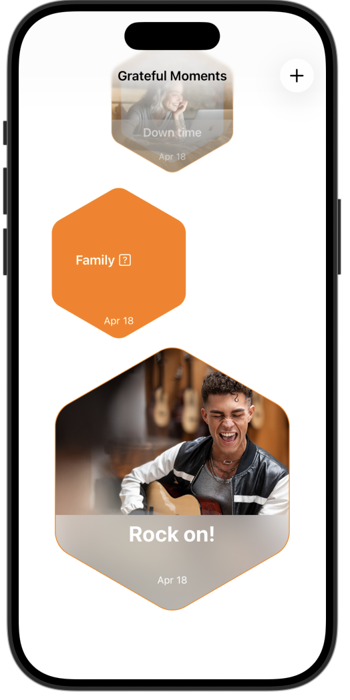
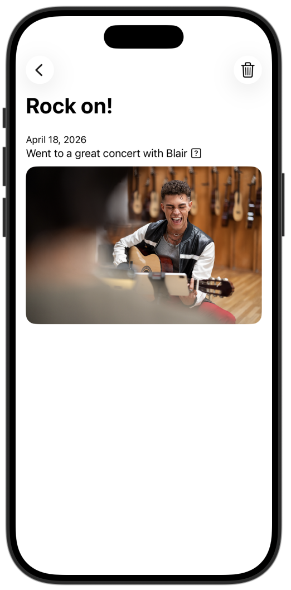
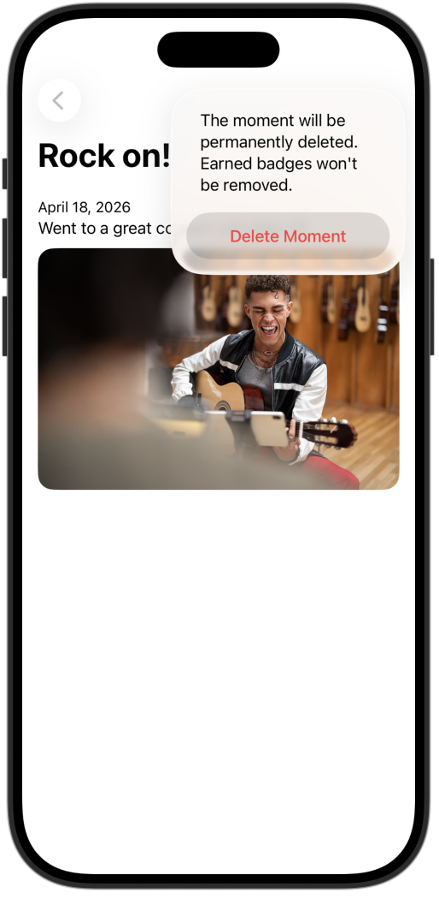
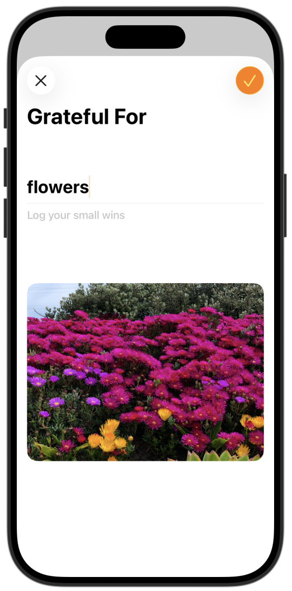
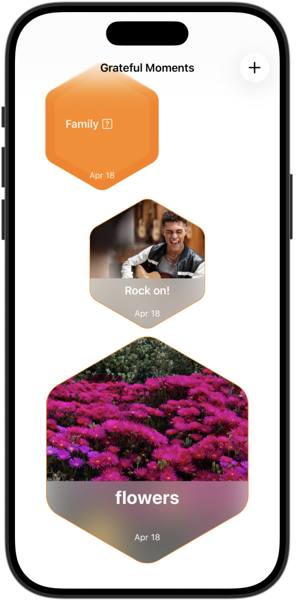

# **[App Development] 2. GratfulMoments - Custom Layout View**

## **배운 내용** 
1.** Moment를 추가하는 모달 화면 만들기**
    ```swift
    @State private var showCreatMoment = false              //모달을 보여줄지 말지 결정하는 변수(초기값은 false)
    ```  
    ```swift
    NavigationStack{
        ScrollView {
            pathItems
                .frame(maxWidth: .infinity)
        }
        .overlay{                                           //모달의 리스트에 아직 저장된 값이 없으면 보여지는 guidance.
            if moments.isEmpty{
                ContentUnavailableView{
                    Label("No moments yet!", systemImage: "exclamationmark.circle.fill")
                }description: {
                    Text("Post a note or photo to start filling this space with gratitude.")
                }
            }
        }
        .toolbar{
            ToolbarItem(placement: .primaryAction){
                Button{
                    showCreatMoment = true                  //+버튼 누르면 모달화면 보여줌
                }label:{
                    Image(systemName: "plus")
                }.sheet(isPresented: $showCreatMoment){
                MomentEntryView()                           //모달로 보여지는 화면
                }
            }
        }
        .navigationTitle("Grateful Moments")                // 모달 화면 제목
    }
    ```
2.** Delete 버튼, 경고창 만들기**
    ```swift
    @State private var showConfirmation = false              //삭제 경고창 보여주는 변수(초기값은 false)
    ```  
    ```swift
    ScrollView{
        contentStack                                        //body 안에 private var : some View{}로 정의
    }
    .navigationTitle(moment.title)
    .toolbar{
        ToolbarItem(placement: .destructiveAction){         //휴지통 버튼
            Button{
                showConfirmation = true
            }label:{
                Image(systemName: "trash")
            }
            .confirmationDialog("Delte Moment", isPresented: $showConfirmation){    //휴지통 버튼 누르면 confirmationDialog 뜸
                Button("Delete Moment", role:.destructive){                         //confirmationDialog 제목
                        
                }                                                                   //confirmationDialog 메세지
            }message: {
                Text("The moment will be permanently deleted. Earned badges won't be removed.")
            }
        }
    }
    ```
    
3.** 삭제 동작 만들기**
    1. dataContainer에서 데이터 지우기
    ```swift
    @Environment(DataContainer.self) private var dataContainer                 //dataContainer 불러오기
    ```
    ```swift
    .confirmationDialog("Delte Moment", isPresented: $showConfirmation){        
        Button("Delete Moment", role:.destructive){
            dataContainer.context.delete(moment)                            //dataContainer에서 데이터 삭제
            try? dataContainer.context.save()
        }
    ```
    2. 해당 데이터의 detailView 지우기
    ```swift
        @Environment(\.dismiss) private var dismiss                         
    ```
    ```swift
    .confirmationDialog("Delte Moment", isPresented: $showConfirmation){
        Button("Delete Moment", role:.destructive){
            dataContainer.context.delete(moment)
            try? dataContainer.context.save()
            dismiss()                                                   //detailView 삭제
        }
    ```
## **preview**
<p align="center">
  
  
  
  
  
</p>


## **tutorial link**
[Apple Developer Tutorial](https://developer.apple.com/tutorials/develop-in-swift/use-a-custom-layout-view)


