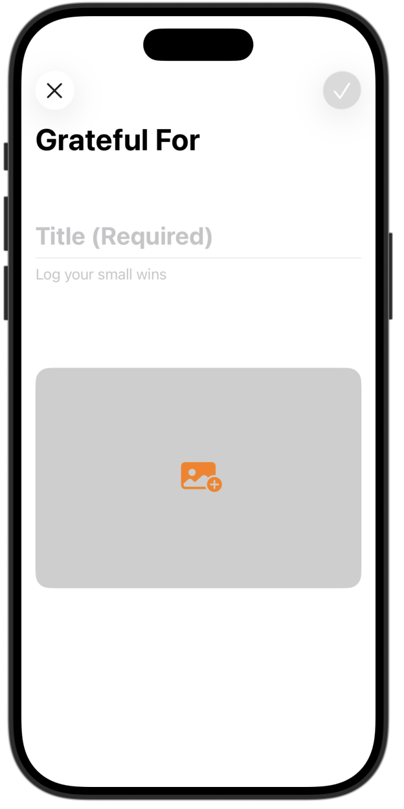

# **[App Development] 1. GratfulMoments**

## **배운 내용** 
1.** `TextField` 줄 개수 설정**: .multilineTextAlignment(), .lineLimit 사용하기
    ```swift
    TextField("Log your small wins", text: $note, axis: .vertical)
        . multilineTextAlignment(.leading)
        .lineLimit(5...Int.max)
    ```
2.** `import PhotosUI`, `photoPicker` 만들기 **: 디바이스의 포토 라이브러리에 접근해서 사진을 고르는 UI.
    1. `import PhotosUI`, `photoPicker` 만들기
    
    ```swift
    private var photoPicker: some View{
        Image(systemName: "photo.badge.plus.fill")
            .font(.largeTitle)
            .frame(height: 250)
            .frame(maxWidth: .infinity)
            .background(Color(white: 0.4, opacity: 0.32))
            .clipShape(RoundedRectangle(cornerRadius: 16))
    }
    ```
    
    2. `newImage` 변수 선언 + Image를 `PhotoPicker(selection:$newImage){}` 로 감싸기
        ```swift
        @State private var newImage: PhotosPickerItem?
        ```
        ```swift
        PhotosPicker(selection: $newImage){
            Image(systemName: "photo.badge.plus.fill")
                .font(.largeTitle)
                .frame(height: 250)
                .frame(maxWidth: .infinity)
                .background(Color(white: 0.4, opacity: 0.32))
                .clipShape(RoundedRectangle(cornerRadius: 16))
        }
        ```
        
    3. `.onChange` Modifier 붙이기
        ```swift
        .onChange(of: newImage){
        guard let newImage else {return}
        }
        ```
    4. `imageData` 변수 선언 + `Task` 붙이기
        ```swift
        @State private var imageData: Data?
        ```
        ```swift
        Task{
            imageData = try await newImage.loadTransferable(type: Data.self)
        }
        ```
    5. `if else` 문으로 이미지를 불러왔을 경우와 안불러왔을 경우 화면 구분하기 + `Group` 으로 아이콘과 photoArea 구분하기
        ```swift
        PhotosPicker(selection: $newImage){
            Group{
                if let imageData, let uiImage = UIImage(data: imageData){
                    Image(uiImage: uiImage)
                        .resizable()
                        .scaledToFit()
                }else{
                    Image(systemName: "photo.badge.plus.fill")
                        .font(.largeTitle)
                        .frame(height: 250)
                        .frame(maxWidth: .infinity)
                        .background(Color(white: 0.4, opacity: 0.32))
                }
                
            }
            .clipShape(RoundedRectangle(cornerRadius: 16))
        }
        ```

    

## **preview**
<p align="center">
  
</p>


## **tutorial link**
[Apple Developer Tutorial]()


